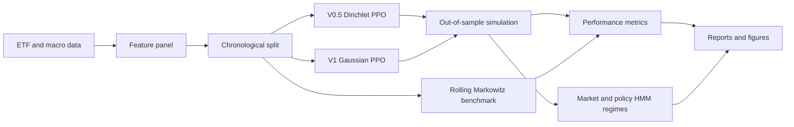

# Reinforcement Learning for Portfolio Optimization

An end-to-end research project comparing PPO-based dynamic asset allocation with a rolling mean-variance benchmark. The system uses U.S. sector ETFs, a Treasury-bill allocation, macroeconomic features, transaction-cost-aware rewards, and hidden Markov models for market- and policy-regime analysis.

> This repository is Nigel Chi's public project edition of a jointly authored Carnegie Mellon University Machine Learning II group project. See [Contributors](CONTRIBUTORS.md) for full team credit.

## Project at a glance

The project asks whether reinforcement learning can learn economically meaningful, state-dependent portfolio policies and whether those policies respond sensibly to changing volatility, correlation, dispersion, and macroeconomic conditions.

Two notebook-derived PPO workflows are preserved:

- **V0.5 Dirichlet:** a long-only, fully invested policy whose normalized actions produce portfolio weights on the simplex.
- **V1 Gaussian:** a less constrained Gaussian policy that assigns the residual allocation to BIL and can take short risky-asset exposures.

Both are evaluated against a rolling Markowitz portfolio and analyzed across four-state Gaussian HMM regimes.



## Research design

### Investable universe

The investable universe contains 11 U.S. sector ETFs plus BIL as a short-duration Treasury proxy. Monthly observations span December 2016 through December 2025.

### State representation

The policy observes:

- asset-level one-month returns, realized volatility, and Amihud illiquidity;
- cross-sectional correlation and dispersion;
- inflation, industrial production, term spread, federal funds rate, high-yield credit spread, and VIX features; and
- the previous portfolio allocation, enabling turnover-aware decisions.

### Objective and evaluation

The environment rewards compounded portfolio growth after modeled transaction costs and, where configured, a concentration penalty. The sample is split chronologically:

| Split | Period | Purpose |
|---|---:|---|
| Training | 2016-2022 | Policy optimization |
| Validation | 2023 | Generalization monitoring |
| Test | 2024-2025 | Final out-of-sample evaluation |

Evaluation includes terminal wealth, CAGR, annualized volatility, maximum drawdown, six-month rolling volatility, and Sharpe ratio. Monte Carlo action sampling measures how sensitive each learned policy is to stochastic decisions.

## Repository layout

```text
rl_portfolio_optimization/
├── data/
│   ├── raw/                    # Macro and ETF feature datasets
│   └── derived/                # Derived regime labels
├── docs/
│   └── Machine Learning II Project Report.pdf
├── notebooks/
│   ├── data_preparation/       # Reproducible data-collection notebooks
│   ├── sequential_markowitz_reference.ipynb
│   ├── v0_5_reference.ipynb
│   └── v1_reference.ipynb
├── scripts/                    # Runnable end-to-end workflows
├── src/rl_portfolio_optimization/
│   ├── common/                 # Data, metrics, reporting, and runtime helpers
│   ├── notebook_v0_5_dirichlet/
│   └── notebook_v1_gaussian/
├── tests/
├── .env.example
├── Makefile
└── pyproject.toml
```

The modules under `src/` are a notebook-faithful organization of the research logic. The notebooks remain useful for exploration and historical context; the scripts provide repeatable execution paths.

## Installation

Python 3.10 or later is recommended.

```bash
git clone https://github.com/csnigel/rl_portfolio_optimization.git
cd rl_portfolio_optimization
python3 -m venv .venv
source .venv/bin/activate
python -m pip install --upgrade pip
python -m pip install -e '.[parquet,dev]'
```

On Windows PowerShell, activate the environment with:

```powershell
.venv\Scripts\Activate.ps1
```

## Running the workflows

Run commands from the repository root.

```bash
PYTHONPATH=src python scripts/run_notebook_v1_gaussian.py
PYTHONPATH=src python scripts/run_notebook_v0_5_dirichlet.py
```

Equivalent Makefile shortcuts are available:

```bash
make venv
make install
make v1
make v05
```

Each workflow creates a timestamped directory under `reports/` containing a Markdown summary, figures, and derived tables. Generated reports and model artifacts are intentionally ignored by Git.

## Data preparation

The repository includes the compact research datasets required by the organized workflows. The data-preparation notebooks document the Yahoo Finance and FRED collection process.

To rerun the FRED notebook, export your own key in the active shell:

```bash
export FRED_API_KEY="your-own-key"
```

Never commit a real API key. The tracked `.env.example` contains placeholders only.

Install the additional data-collection dependencies when working with these notebooks:

```bash
python -m pip install -e '.[data]'
```

## Results

The course study evaluated each stochastic PPO policy over 1,000 test simulations. The final report found that:

- the long-only Dirichlet policy produced a substantially tighter distribution of outcomes and was more robust to action sampling;
- the Gaussian policy showed greater adaptability and return potential, but materially higher variance and leverage sensitivity;
- both experimental agents compared favorably with the rolling Markowitz benchmark in the reported course backtest; and
- HMM analysis provided a useful interpretation layer for behavior across market and learned-policy regimes.

These are historical simulated results from a short monthly sample, not evidence of deployable live-trading performance. See the [full project report](docs/Machine%20Learning%20II%20Project%20Report.pdf) for the methodology, figures, references, and limitations.

## Testing

The lightweight test suite validates portfolio-weight constraints, residual BIL allocation, transaction-cost accounting, and performance-summary outputs without running model training:

```bash
python -m pytest -q
```

## Limitations

- The monthly dataset is small for deep reinforcement learning.
- Results are sensitive to reward design, transaction costs, constraints, and random action sampling.
- The Gaussian policy can express leveraged or short exposures and therefore has a materially different risk profile from the long-only policy.
- HMM state labels are statistical clusters, not immutable economic regimes.
- Backtests do not capture all implementation costs, liquidity limits, taxes, borrowing constraints, or live execution risk.

## Attribution and related repository

This project was jointly developed by Sergio Arango, Nigel Chi, and Mihika Ghaisas. The repository structure follows the collaborators' organized project version at [mghaisas17/rl_portfolio_optimization](https://github.com/mghaisas17/rl_portfolio_optimization). The final report retains the original team attribution.

No open-source license is asserted in this repository because the jointly authored reference repository does not currently specify one. The code is publicly viewable, but reuse permissions should be obtained from the authors.

## Disclaimer

This project was developed for educational and research purposes. It is not investment advice, does not represent live-trading performance, and is not designed for deployment in real financial markets without substantial additional validation, controls, and execution infrastructure.
